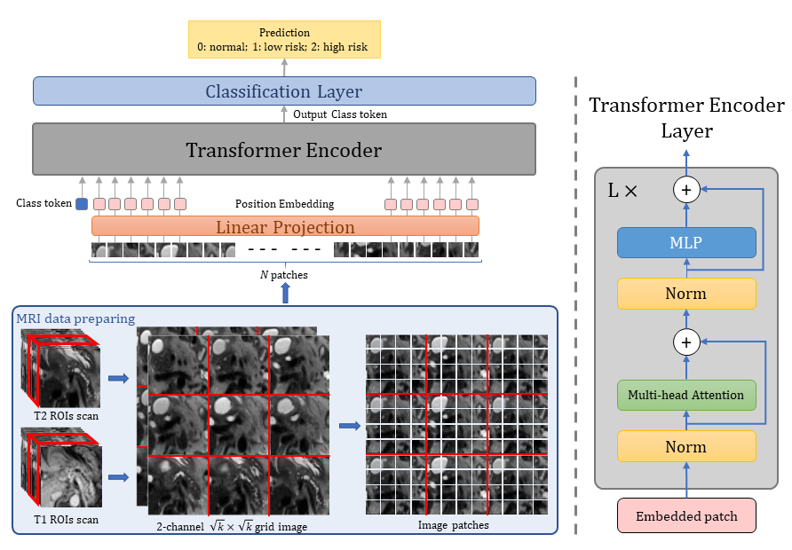

<div align="center">
  
# Neural Transformers for Intraductal Papillary Mucosal Neoplasms (IPMN) Classification in MRI images
  Federica Proietto Salanitri, Giovanni Bellitto, Simone Palazzo, Ismail Irmakci, Michael B. Wallace, Candice W. Bolan, Megan Engels, Sanne Hoogenboom, Marco Aldinucci, Ulas Bagci, Daniela Giordano, Concetto Spampinato
 
[](https://arxiv.org/abs/2206.10531)
[]()
</div>

# Overview
Official PyTorch implementation for paper: <b>"Neural Transformers for Intraductal Papillary Mucosal Neoplasms (IPMN) Classification in MRI images"</b>

# Abstract
Early detection of precancerous cysts or neoplasms, i.e., Intraductal Papillary Mucosal Neoplasms (IPMN), in pancreas is a challenging and complex task, and it may lead to a more favourable outcome. Once detected, grading IPMNs accurately is also necessary, since low-risk IPMNs can be under surveillance program, while high-risk IPMNs have to be surgically resected before they turn into cancer. Current standards (Fukuoka and others) for IPMN classification show significant intra- and inter-operator variability, beside being error-prone, making a proper diagnosis unreliable. The established progress in artificial intelligence, through the deep learning paradigm, may provide a key tool for an effective support to medical decision for pancreatic cancer. In this work, we follow this trend, by proposing a novel AI-based IPMN classifier that leverages the recent success of transformer networks in generalizing across a wide variety of tasks, including vision ones. We specifically show that our transformer-based model exploits pre-training better than standard convolutional neural networks, thus supporting the sought architectural universalism of transformers in vision, including the medical image domain and it allows for a better interpretation of the obtained results.

# Method

<p align = "center"></p>

# Code and models

- This code is an adapted version of the original available [here](https://github.com/jeonsworld/ViT-pytorch).

- The ViT-B16 weights can be downloaded from [here](https://console.cloud.google.com/storage/browser/vit_models;tab=objects?prefix=&forceOnObjectsSortingFiltering=false).

# Citation

```bibtex

```
